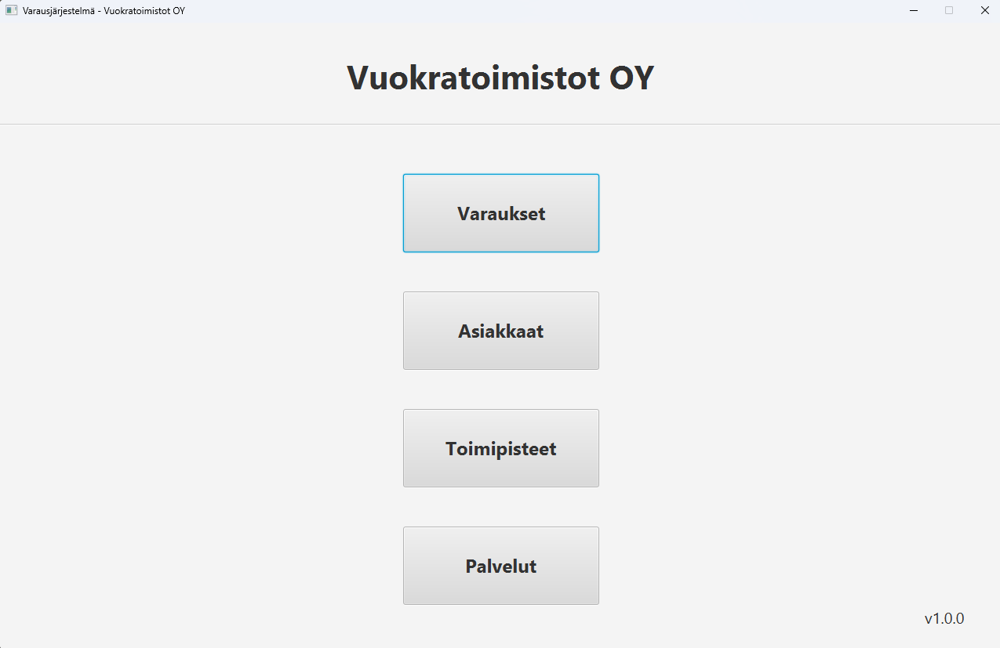

# Toimistotilojen varausjärjestelmä
Järjestelmän avulla toimistotiloja vuokraava yritys pystyy hallinnoimaan varauksia, asiakkaita, toimipisteitä ja palveluja. 
Tämä on kurssin Ohjelmistotuotanto 1 projektityö ja se on tehty kuuden hengen ryhmässä.

## Mistä vastasin projektissa?
- asiakas-näkymän toteutus
- teknisen toteutuksen projektijohtajana toimiminen
- tietokannan luonti
- tietokannan hallinta ohjelmallisesti
- käyttöliittymän suunnittelun avustaminen

## Toiminnot ja näkymät:
- etusivu 
 
- varausten hallinta 
 
- asiakkaiden hallinta 
 
- toimipisteiden hallinta 
 
- palveluiden hallinta 
 

## Käytetyt teknologiat:
- Java
- JavaFX
- SceneBuilder
- MariaDB
- IntelliJ IDEA
- Azure DevOps

## Käyttöönotto:
1. Luo tietokanta `tietokannan_luonti.sql`:n avulla (halutessasi voit myös lisätä esimerkkitietueita `tiedot_tietokantaan.sql`-tiedoston avulla)
2. Kopioi `tietokanta.properties.example` projektikansion juureen
3. Nimeä se uudelleen `tietokanta.properties` nimiseksi
4. Lisää tiedostoon tietokannan kirjautumistiedot ohjeiden mukaisesti
